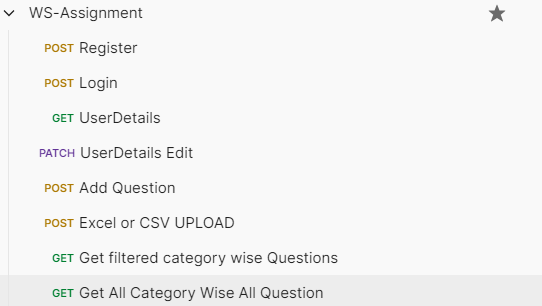

# ws-assignment

## All Credentials are written in env for security purposes only db url is publicly available

## User Specific Routes:

1.Register : (i) with photo upload usuing cloudinary
2.Login : (i) use cookie to store JWT token for more security protection
3.Fetch/Get Userdata : (i) with Authentication middle wire (ii) fetch data without password field for security purposes
4.Edit Userdata: (i) with Authentication middle wire (ii) if new photo upload then it will delete prev photo from cloud and add new photo and replace the old photo link with new photo link

## Category and Question specific Routes:

Only an loggedIn user is allowed to add question.A question may have multiple categories.If category exist it will not create new category , if category not present then it will add the category and add the new category id the questions.

1.Single add Question: (i) with Authentication middle wire (ii) aggregation is used
2. Category wise Question fetch with seacrh filter: (i) with Authentication middle wire (ii) if we add query param it will search accordingly else it will group according to category (ii) aggregation is used
3.Bulk add Question: (i) with Authentication middle wire (ii) aggregation is used